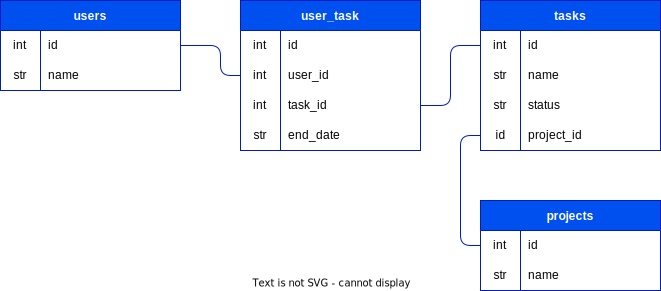

# PROJECT PITCH
### Name: Kanban Board
### Owner: Igor 

### Phase and Cohort:  Phase 4


### One sentence app description:
Project management tool designed to help visualize work progress


## Models: 



## MVP:
C
R
U
D


## BACKEND (API)
### MODELS
* many-to-many relationship
* A `User` has many `Task`s through `User_Task`s
* A `Task` has many `User`s through `User_Task`s 
* A `User_Task` belongs to a `User` and belongs to a `Task`
* A `Project` has many `Task`s 
* A `Task` belongs to a `Project`


### validations 
* Add validations to the `User` model:
* - must have a `name`
* Add validations to the `Task` model:
* - must have a 'name' and 'project_id'
* Add validations to the `Project` model:
* - must have a `name`
* Add validations to the `User_Task` model:
* - must have a 'end_date' and be equal to or greater than Today

## CONTROLLERS
​​API routes 
RESTful conventions 

**User**
```
GET /user/
POST /user/
```

```
GET /user/<int:id>
PATCH /user/<int:id>
DELETE /user/<int:id>
```
**Project**
```
GET /project/
POST /project/
```

```
GET /project/<int:id>
PATCH /project/<int:id>
DELETE /project/<int:id>
```
**Task**
```
GET /task/
POST /task/
```

```
GET /task/<int:id>
PATCH /task/<int:id>
DELETE /task/<int:id>
```
## FRONTEND (REACT)

- Add Figma wireframe   
- Which components will make requests to your API?  
- Discribe routes


EXTRA!  
Stretch goals:
- Search
- 
-